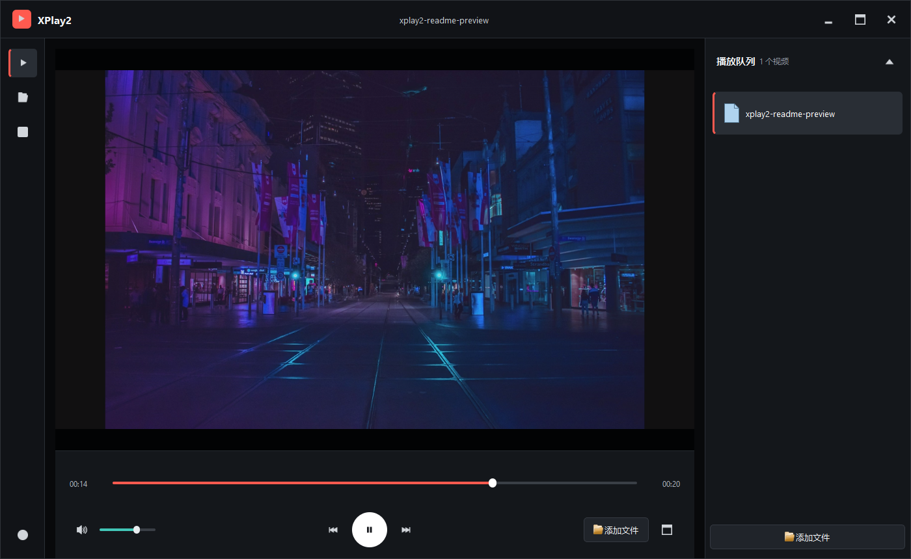

# XPlay2

基于 Qt 6、FFmpeg 和 OpenGL 的 Windows 64 位桌面视频播放器。



## 功能

- 现代深色播放器界面和响应式布局
- 视频播放、暂停、进度跳转和播放时间显示
- 音量调节与静音
- 播放队列和文件拖放
- 按原始宽高比显示视频，自动添加黑边
- 支持从命令行直接打开视频文件

## 构建环境

- Qt 6.5.3 MinGW 64-bit
- CMake 3.21 或更高版本
- Ninja
- FFmpeg 64 位开发库和运行库

项目预设默认使用以下安装路径：

```text
D:/Qt/6.5.3/mingw_64
D:/Qt/Tools/mingw1120_64
D:/QtProject
```

FFmpeg 根目录也可以通过 `FFMPEG_ROOT` CMake 参数或
`XPLAY2_FFMPEG_ROOT` 环境变量指定。

## 编译

```powershell
cmake --preset qt6-mingw-x64
cmake --build --preset qt6-mingw-x64-debug --parallel
```

生成的程序位于：

```text
build/qt6-mingw-x64-debug/bin/XPlay2.exe
```

构建完成后，CMake 会自动将所需的 FFmpeg DLL 复制到程序目录。

## 操作

| 操作 | 快捷键 |
| --- | --- |
| 打开视频 | `Ctrl+O` |
| 播放或暂停 | `Space` |
| 后退或前进 10 秒 | `Left` / `Right` |
| 进入全屏 | `F` / `F11` |
| 退出全屏 | `Esc` |

也可以将视频文件直接拖入窗口，或通过命令行打开：

```powershell
XPlay2.exe "D:/Videos/example.mp4"
```

## 开源协议

本项目采用 [MIT License](LICENSE) 开源协议。
